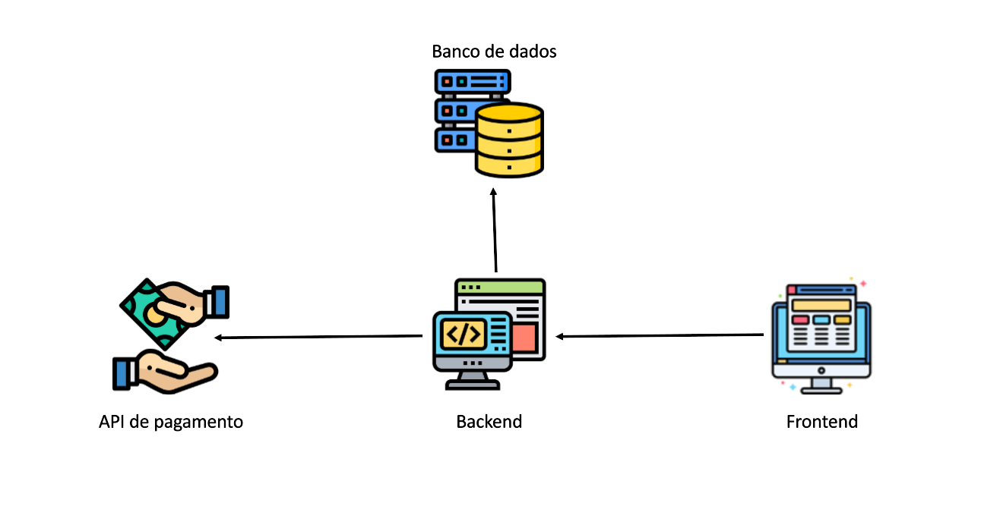

# Especificações do Projeto

Pré-requisitos: <a href="1-Documentação de Contexto.md"> Documentação de Contexto</a>

Esta seção detalha o problema e a ideia de solução do projeto do ponto de vista do usuário. Inclui a definição do diagrama de personas, histórias de usuários, requisitos funcionais e não funcionais, bem como as restrições do projeto.

## Arquitetura e Tecnologias

Para atender os requisitos funcionais e não funcionais propomos a seguinte arquitetura.

## Project Model Canvas

Colocar a imagem do modelo construído apresentando a proposta de solução.

> **Links Úteis**:
> Disponíveis em material de apoio do projeto

## Requisitos

As tabelas que se seguem apresentam os requisitos funcionais e não funcionais que detalham o escopo do projeto. Para determinar a prioridade de requisitos, aplicar uma técnica de priorização de requisitos e detalhar como a técnica foi aplicada.

### Requisitos Funcionais

|ID    | Descrição do Requisito  | Prioridade |
|------|-----------------------------------------|----|
|RF-001| O sistema deve permitir que os colaboradores façam login. | ALTA |
|RF-002| O sistema deve permitir que os colaboradores alterem a senha. | ALTA |
|RF-003| O sistema deve permitir gerenciar cadastro de colaboradores pelo administrador. (incluir/alterar/excluir ) | ALTA |
|RF-004| O sistema deve permitir gerenciar cadastro e matricula de aluno. (incluir/alterar/excluir) | ALTA |
|RF-005| O sistema deve permitir gerenciar cadastro de treino do aluno.(incluir/alterar/excluir) | ALTA |
|RF-006| O sistema deve permitir gerenciar cadastro de mensalidade e plano. | ALTA |
|RF-007| O sistema deve conter gerenciamento de contas a pagar e receber. | ALTA |
|RF-008| O sistema deve gerar relatorio financeiror. | MEDIO |
|RF-009| O sistema deve possibilitar pesquisar os alunos. | MEDIO |
|RF-010| O sistema deve conter uma agenda/lembretes. (Data de aniversário, compromissos financeiros) | ALTA |
|RF-011| O sistema deve conter um canal de postagem de informação geral. | ALTA |

### Requisitos não Funcionais

|ID     | Descrição do Requisito  |Prioridade |
|-------|-------------------------|----|
|RNF-001| O App ou site será publicado em um ambiente na Internet. (Azure) | ALTA | 
|RNF-002| A aplicação web será compatível com os principais navegadores do mercado. |  ALTA | 
|RNF-003| A aplicação web deve ser confiável, deve atender às suas especificações. |  MÉDIA | 
|RNF-004| A aplicação web deve tratar acessos não autorizados, garantindo um alto grau de segurança. |  MÉDIA | 
|RNF-005| A interface da aplicação deve ser amigável, ou seja deve se sentir confortável ao utilizar o site, de forma que sua experiência torne-se fácil. |  BAIXA | 

Com base nas Histórias de Usuário, enumere os requisitos da sua solução. Classifique esses requisitos em dois grupos:

- [Requisitos Funcionais
 (RF)](https://pt.wikipedia.org/wiki/Requisito_funcional):
 correspondem a uma funcionalidade que deve estar presente na
  plataforma (ex: cadastro de usuário).
- [Requisitos Não Funcionais
  (RNF)](https://pt.wikipedia.org/wiki/Requisito_n%C3%A3o_funcional):
  correspondem a uma característica técnica, seja de usabilidade,
  desempenho, confiabilidade, segurança ou outro (ex: suporte a
  dispositivos iOS e Android).
Lembre-se que cada requisito deve corresponder à uma e somente uma
característica alvo da sua solução. Além disso, certifique-se de que
todos os aspectos capturados nas Histórias de Usuário foram cobertos.

## Restrições

O projeto está restrito pelos itens apresentados na tabela a seguir.

|ID| Restrição                                             |
|--|-------------------------------------------------------|
|01| O projeto deverá ser entregue no final do semestre letivo. |
|02| O aplicativo deve se restringir às tecnologias básicas da Web de FrontEnd e Backend        |
|03| A equipe não pode subcontratar terceiros para o desenvolvimento do trabalho        |
|04| O projeto não pode ser feito por um único integrante do grupo        |
|05| As decisões pertinentes ao projeto devem ser tomadas por meio democrático de votação        |
|06| O projeto deve estar em conformidade com as leis e normas vigentes        |

Enumere as restrições à sua solução. Lembre-se de que as restrições geralmente limitam a solução candidata.

> **Links Úteis**:
> - [O que são Requisitos Funcionais e Requisitos Não Funcionais?](https://codificar.com.br/requisitos-funcionais-nao-funcionais/)
> - [O que são requisitos funcionais e requisitos não funcionais?](https://analisederequisitos.com.br/requisitos-funcionais-e-requisitos-nao-funcionais-o-que-sao/)

## Diagrama de Casos de Uso

Na Linguagem de modelagem unificada (UML), o diagrama de caso de uso resume os detalhes dos usuários do seu sistema (também conhecidos como atores) e as interações deles com o sistema.

Características dos Diagramas de Casos de Uso:
 ●Mostram um conjunto de casos de uso, atores e seus relacionamentos. 
 ●Modelam aspectos dinâmicos do sistema. 
 ●Proporcionam uma representação contextual do sistema (fronteira explícita). 
 ●Indicam a forma como o sistema interage com as entidades externas (atores). 

## Modelo ER (Projeto Conceitual)

.png)

## Projeto da Base de Dados

O projeto da base de dados corresponde à representação das entidades e relacionamentos identificadas no Modelo ER, no formato de tabelas, com colunas e chaves primárias/estrangeiras necessárias para representar corretamente as restrições de integridade.
