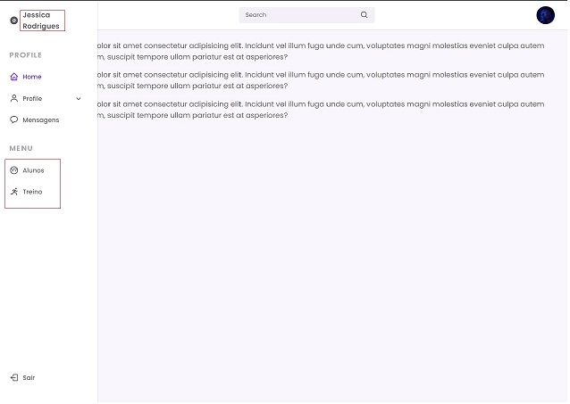
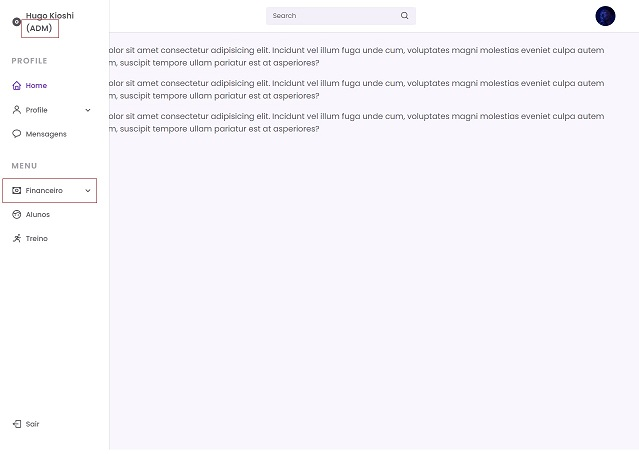

# Planos de Testes de Software

Apresente os cenários de testes utilizados na realização dos testes da sua aplicação. Escolha cenários de testes que demonstrem os requisitos sendo satisfeitos.

Enumere quais cenários de testes foram selecionados para teste. Neste tópico o grupo deve detalhar quais funcionalidades avaliadas, o grupo de usuários que foi escolhido para participar do teste e as ferramentas utilizadas.
 
# Evidências de Testes de Software
### CT-01 - Tela Login

### CT-02 - Login do usuário

### CT-03 - Login Efetuado Usuario Permissão Restrita

### CT-04 - Login do Administrador

### CT-05 - Login Efetuado Permissão ADM

Apresente imagens e/ou vídeos que comprovam que um determinado teste foi executado, e o resultado esperado foi obtido. Normalmente são screenshots de telas, ou vídeos do software em funcionamento.
