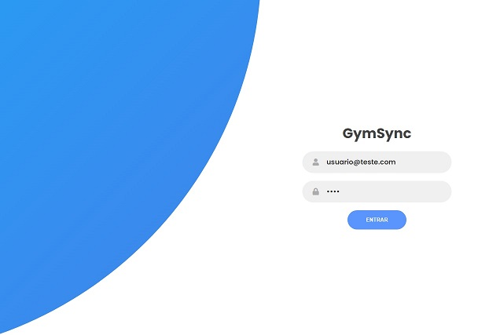
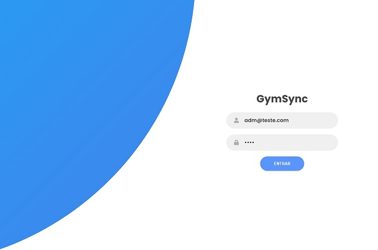

# Registro de Testes de Software

A
Pré-requisitos: <a href="3-Projeto de Interface.md"> Projeto de Interface</a>, <a href="8-Plano de Testes de Software.md"> Plano de Testes de Software</a>

Relatório com as evidências dos testes de software realizados no sistema pela equipe, baseado em um plano de testes pré-definido.

### CT-01 - Tela Login

### CT-02 - Login do usuário

### CT-03 - Login Efetuado Usuario Permissão Restrita

### CT-04 - Login do Administrador

### CT-05 - Login Efetuado Permissão ADM

Apresente imagens e/ou vídeos que comprovam que um determinado teste foi executado, e o resultado esperado foi obtido. Normalmente são screenshots de telas, ou vídeos do software em funcionamento.

## Avaliação

Como demonstra o resultado do teste acima, ...

| Requisitos          |              Descrição             |Comentarios/Consideraçãoes|Status                                  |
|---------------------|------------------------------------|--------------------------|----------------------------------------|
|CT-001 – Login do usuário |Permite ao usuário, cadastrar, fazer login e editar  |  |      Funcionando        |
|CT-002 – Alteração de senha | Permite que o usuário altere a senha| | Com Problema |
|CT-003 – Gerenciamento de Colaboradores| Permite gerenciar cadastro de colaboradores pelo administrador.| |Funcionando |
|CT-004 – Gerenciamento de Cadastro de Clientes| Permite gerenciar cadastro de clientes.|  |Funcionando |
|CT-005 – Gerenciamento de Mensalidade| Permite permitir gerenciar cadastro de mensalidade.|  | Funcionando |
|CT-006 – Gerenciamento de contas a receber e despesas| Permite gerenciar de contas a receber e despesas.|  | Funcionando |
|CT-007 – Pesquisa específica por cliente|Permite pesquisar cliente. |  | Funcionando |

