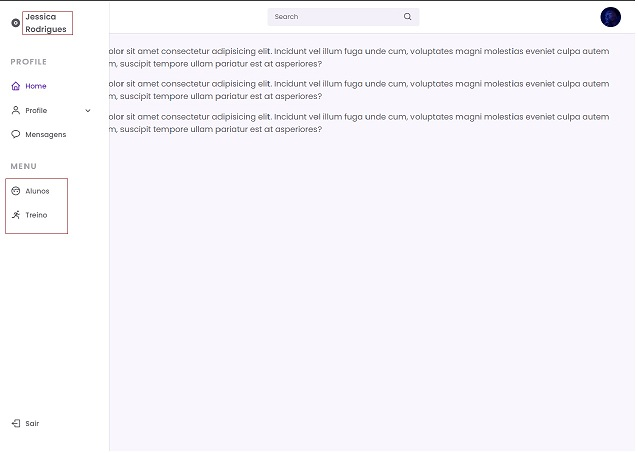

# Registro de Testes de Software

A
Pré-requisitos: <a href="3-Projeto de Interface.md"> Projeto de Interface</a>, <a href="8-Plano de Testes de Software.md"> Plano de Testes de Software</a>

Relatório com as evidências dos testes de software realizados no sistema pela equipe, baseado em um plano de testes pré-definido.

### CT-01 - Tela Login

### CT-02 - Login do usuário

### CT-03 - Login Efetuado Usuario Permissão Restrita

### CT-04 - Login do Administrador

### CT-05 - Login Efetuado Permissão ADM

Apresente imagens e/ou vídeos que comprovam que um determinado teste foi executado, e o resultado esperado foi obtido. Normalmente são screenshots de telas, ou vídeos do software em funcionamento.

## Avaliação

Como demonstra o resultado do teste acima, ...

| Requisitos          |              Descrição             |Comentarios/Consideraçãoes|Status                                  |
|---------------------|------------------------------------|--------------------------|----------------------------------------|
|CT-001 – Login do usuário |Permite ao usuário, cadastrar, fazer login e editar  |  |              |
|CT-002 – Alteração de senha | | | |
|CT-003 - Gerenciamento de Colaboradores| | | |
|CT-004 - Gerenciamento de Alunas| |  | |
|CT-005 - Gerenciamento de Treinos| | | |
|CT-006 - Gerenciar cadastro de mensalidade ou plano| |  |  |
|CT-007 - Gerenciamento de contas a pagar e recebimentos| |  |  |
|CT-008 - Geração de relatório financeiro| |  |  |
|CT-009 - Pesquisa específica por aluna| |  |  |
|CT-010 - Data de aniversário e/ou compromissos financeiros| |  |  |
|CT-011 - Canal de informações|  |  |

> **Links Úteis**:
> - [Ferramentas de Test para Java Script](https://geekflare.com/javascript-unit-testing/)
